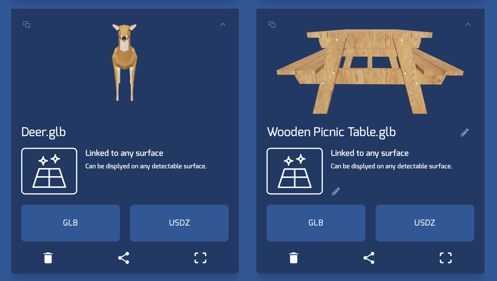
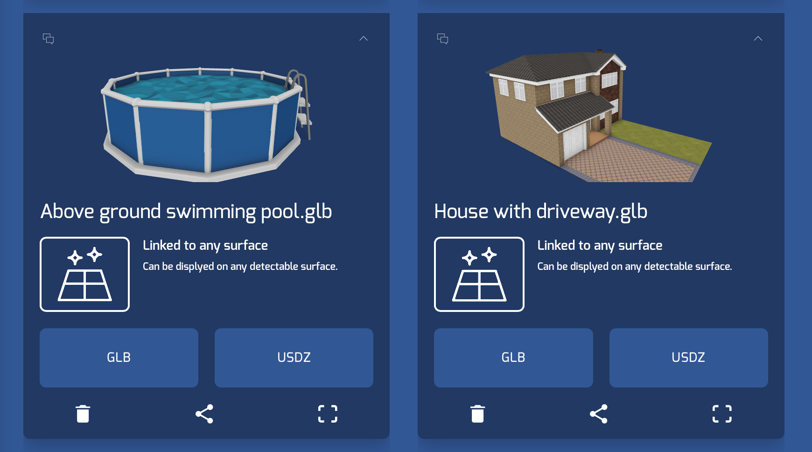
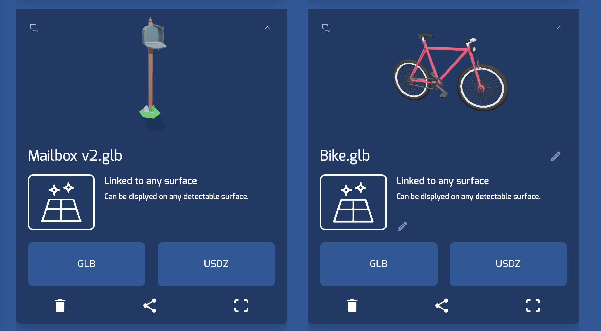
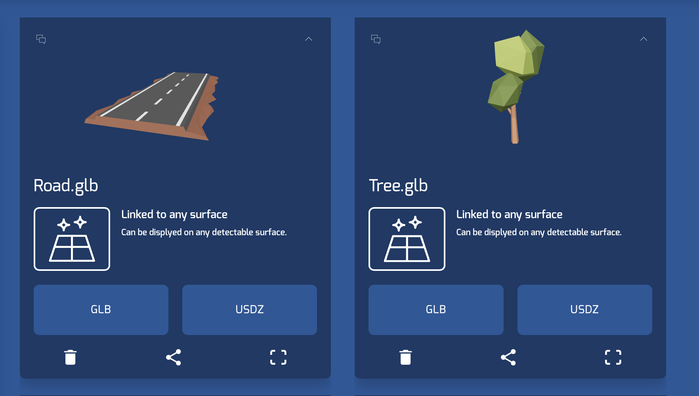

# iOS-ARKit-echo3D-Demo-TownBuilder
This is a tabletop augmented reality iOS demo app, built with the echo3D Swift SDK, that allows users to build virtual neighborhoods on horizontal surfaces. This project does not require you to enter your echo3D API key or entry IDs as they are already embedded in the project. To swap these out for your own assets, follow the steps below. 

## Setup
* Register for FREE at [echo3D](https://console.echo3D.co/#/auth/register).
* Clone this repository and open in XCode.

## Video
* See on Youtube [here](https://youtu.be/zSa2_1UCCMI).

## Steps
* Open ARTownBuilderDemo.xcodeproj using Xcode (Note: If you have Xcode downloaded you simply double click the file to open).
* Go to the "Signing & Capabilities" tab in Xcode and fill out your signing information. See more details [here](https://docs.echo3d.co/swift/adding-ar-capabilities).
* Go to the EchoAR.swift file and insert your API key as a string where it says "insert api key here".
* [Add your models to the echo3D console](https://docs.echo3D.co/quickstart/add-a-3d-model) or choose from our library.
* Go to the ViewController.swift file, add the entry ID's for 3D content you have added to your echo3D console where it says "insert entry id here".  
 
* [Uncheck](https://docs.echo3d.co/web-console/deliver-pages/security-page) the “Enable Secret Key” box in your echo3D console (Note: For a production build, it’s best to [add the echo3D API key](https://docs.echo3d.co/web-console/deliver-pages/security-page) to the echo3D.cs script so it remains secure).
* Connect your iPhone to your computer.
* Select your iPhone on the dropdown list of devices to run the demo app on.
* Press the Play button to build and run (Note: your device must be unlocked and in Developer Mode to run).

## Run
* Move your phone around a horizontal surface to scan a plane.
* If the "Add" button is selected, choose an object to add and touch somewhere on your horizontal plane to add it.
* If any other edit buttons are selected such as drag, rotate, or delete, tap or drag on the object you would like to edit.
* Objects can be scaled at any time by doing the two finger pinch gesture on them.

## Learn More
Refer to our [documentation](https://docs.echo3D.co/unity/) to learn more about how to use echo3D and the Swift SDK

## Troubleshooting
Visit our troubleshooting guide [here](https://docs.echo3d.co/unity/troubleshooting#im-getting-a-newtonsoft.json.dll-error-in-unity).

## Support
Feel free to reach out at [support@echo3D.co](mailto:support@echo3D.co) or join our [support channel on Slack](https://go.echo3D.co/join). 

## Screenshots

## Additional Notes
Users can drag nodes to be buried underneath the horizontal plane. Because dragging the horizontal plane
itself is not allowed in the demo, this then gets the node stuck underneath the plane.  
    * Depending on use case, this can be solved by allowing the editing of the horizontal plane (see the isPlane() function).  
    * Note: Toggling the horizontal plane toggles visibility, but the plane node is still in the scene. 

### Images of the default entries for the demo

Demo created by [Daye Jack](https://github.com/ddj231/).
